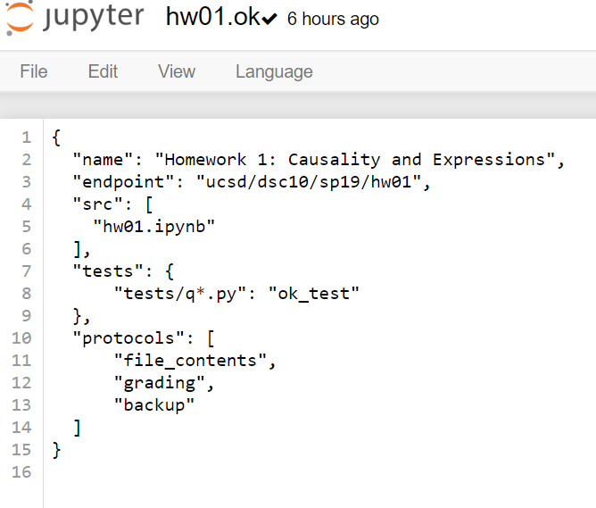
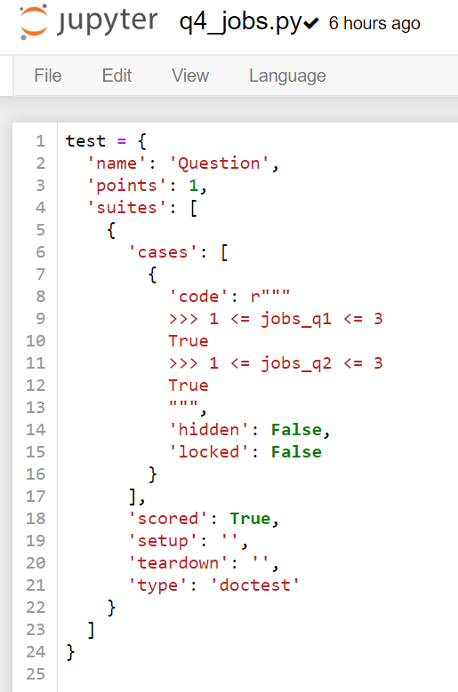

# dsc10_tests_creation_guide
A tutorial for the DSC10 tutors about how to write formatting tests or correctness tests.
### ______________________________________________________________________________________

# ~ SETUP ~ 
This part is to setup your work space.  
Here, I don’t recommend you work on your local machine because the environment you have on your machine may be different from that of DataHub. Therefore, some testers you write may run on your local machine, but not on DataHub, which the students use.  
In one ward, to avoid version problems, it is better to work on DataHub. (Or at least make sure it runs on DataHub)  
To setup work space on DataHub, you have 2 choice.  
## Choice 1 (easier):
#### You can open a terminal in DataHub and directly clone the dsc10 repo: 
•	Open a terminal by clicking “new” -> “terminal” on DataHub.  
•	In case you are not familiar with GitHub, in your terminal, use the following command to clone the dsc10 private repo to your DataHub, where "github URL" should be replaced by the actual URL you copy from the dsc10 private repo. 

        git clone <github URL> 
•	After cloning, you should see the directory of dsc10 created on your datahub. 
•	When you done with creating/modifying tests, in terminal, use commands
  
    git add *
    git commit -m “your message”
    git push
•	Your changes will be on the dsc10 repo.

## Choice 2:
#### Clone repo to your laptop first and then upload to DataHub: 
•	In case you are not familiar with GitHub, open the terminal on your lapotp and use the following command 
to clone the dsc10 private repo to your local machine, where "github URL" should be replaced by the actual URL you copy from the dsc10 private repo. 

        git clone <github URL> 
•	After cloning, you should see the directory of dsc10 created on your machine. 
•	Then you can upload the files to DataHub.  
•	To upload folders to DataHub, simply log in to DataHub (u should have access) and upload the files for the specific homework. It will look like, for example: 
     
Note that you cannot upload a whole folder to DataHub, so you need to create a folder in DataHub and upload the files inside. 

•	When you done with creating/modifying tests, download the files you modified back to your laptop, in the dsc10 repo you cloned. 
•	Then, in the terminal, use commands

    git add *
    git commit -m “your message”
    git push
•	Your changes will be on the dsc10 repo. 
 

#  ~ CONCEPTS ~
## Part1: ok files
•	An ok file is a json-format config file for a Jupyter Notebook. A sample ok file looks like:  
   
•	Explanation for the content of an ok files:  
1.	“name” specifies the name of this ok file.  
2.	“endpoint” specifies the location of the notebook.  
3.	“src” is the source notebook file.  
4.	“tests” specify what tests the notebook file will use to run. On the picture above, it uses the tests under directory “tests”. If you want to use the tests in other directories, says, “correctness_tests”, you simply change the name there; then it becomes: “test”:  {“correctness_tests / q*.py” : “ok_test”}  
5.	For “protocols”, you don’t need to care.  

### Part 2: the codes in jupyter notebook 
In the notebook files, you can see these ok-related codes:  
 
This line specifies the ok file this notebook uses.
   
        ok = Notebook('hw01.ok')
This line will run the file named “q1” under the directory you specify in the ok file. (In the “tests” section of the ok file). 
   
        _ = ok.grade('q1')

### Part 3: tests files
•	These files are the py files under the “tests” or “correctness_tests” directory, and they are the ones you need to create/modify. 
•	A sample tests file:
    
•	In the ‘code’ part, within the “”” pair are the tester codes you will need to write/modify. The codes after >>> are the python codes the will be run inside the jupyter notebook, when something like `_ = ok.grade(‘q1’)` is called. And the lines without >>> are the expected result of the previous line. For example, you can have something like:

        ‘code’: r”””
        >>> my_var = 1.234
        >>> a = student_create_funct(1.234)
        >>> 201 > a > 200		# the correct answer should be between 200 n 201
        True
        >>> student_create_funct2(my_var)	# the correct answer is exactly 30
        30
        “”” 
•	Check out the test files of previous quarters to learn some useful testing method (ie. isinstance() ).

 

# ~ WORK FLOW ~
## For formatting tests writers:
•	Setup the work space.  
•	Create / modify the test files.  
•	Check the tests you wrote are correct. To do this, you can run your tests against the solution notebook:  
1.	Create an ok file for the solution notebook. It should be same as the original ok file except the ‘src’ part now becomes the solution notebook.  
2.	Specify in the solution notebook to use the ok file you just created. ie:

        ok = Notebook('hw01_solution.ok')

3.	Run the tests in the solution notebook to make sure they all pass.
•	Commit your change and push back to the dsc10 repo.  

## For correctness_tests writers:
•	Setup the work space.  
•	Create / modify the test files under the folder “correctness_tests”.  
•	Check the tests you wrote are correct. To do this, you can run your tests against the solution notebook:  
1.	Create an ok file for the solution notebook. It should be same as the original ok file except the ‘src’ part now becomes the solution notebook, and the ‘tests’ part now uses “correctness_test” folder.  
2.	Specify in the solution notebook to use the ok file you just created. ie:

        ok = Notebook('hw01_solution.ok')

3.	Run the tests in the solution notebook to make sure the correctness_tests you wrote were correct.  
•   Commit your change and push back to the dsc10 repo.  

 

